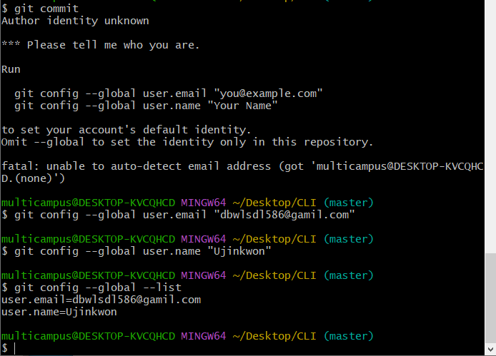
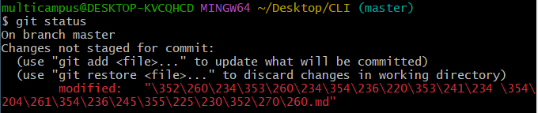
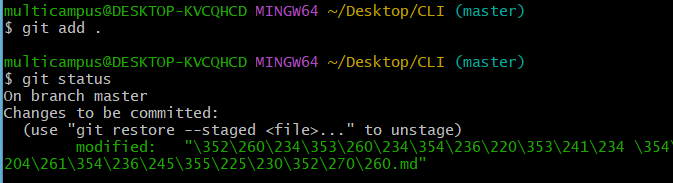
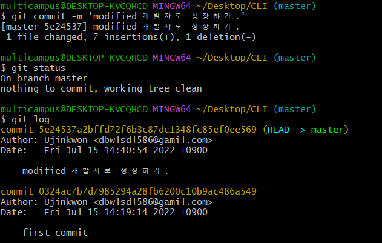
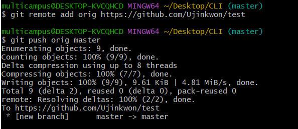

# Git 기본기

* Git : 분산 버전 관리 시스템
  
  * 변경사항 & 최종본만

* 경로
  
  * 절대 경로 - 루트 디렉토리부터 목적 지점까지 거치는 모든 경로
  * 상대 경로 - 현재 작업하고 있는 디렉토리를 기준으로 계산된 상대적 위치

* 기본적인 명령어
  
  * `touch` : 파일 생성
  * `mkdir` : 폴더 생성
  * `ls` : 현재 작업 중인 디렉토리의 폴더/파일 목록 보여줌
  * `ls -a` : 하위 파일, 숨김처리 된 파일까지 확인
  * `cd` : 현재 작업 중인 디렉토리 변경 
  * `cd ..` : 상위 폴더로 나가기
  * `start` : 폴더/파일 열기
  * `code` : vscode로 open
  * `rm` : 파일 삭제
  * `rm -rd` : 폴더 삭제

* README.md
  
  * 프로젝트에 대한 설명 문서
  
  * github 프로젝트에서 가장 먼저 보는 문서
  
  * 일반적으로 소프트웨어와 함께 배포
  
  * 작성 형식은 따로 없으나, 일반적으로 마크다운을 이용해 작성

* Repository
  
  * 특정 디렉토리를 버전 관리하는 저장소
  
  * `git init` 명령어로 로컬 저장소를 생성
  
  * .git 디렉토리에 버전 관리에 필요한 모든 것이 들어있음
  
  * `git init`을 입력하면 .git이 생성
  
  * `git init` 입력 시 경로 옆에 master => git으로 관리됨을 의미

* README.md 생성

* 커밋(commit)은 3가지 바탕으로 동작
  
  * Working Directory : 내가 작업하고 있는 실제 디렉토리
  * Staging Area : 커밋으로 남기고 싶은, 특정 버전으로 관리하고 싶은 파일이 있는 곳 (중간 확인 공간)
  * Repository : 커밋들이 저장되는 곳 
  * Working Directory에서 버전 관리할 파일들만 Staging area으로 올려놓은 뒤, Repository에 저장 (저장되면, Staging area은 비워짐)
  * untracked -(`git add`)-> staged -(`git commit`)-> committed
  
  ​       untracked => modified로 변경됨

* `git add .` : 모든 파일을 staging area로 올리기
* `git commit` : 처음 할 때 사용자 이메일 입력 필요
* `git commit` => VIM(2가지 mode)
  * command : esc 누르면 command 받을 수 있는 상태로
  * edit : i 누르면 메세지 추가 가능
  * `:wq` => 저장하고 나감 

* `git status` : 현재 상태 
  
  * On branch master
  * No commits yet
  * Changes to be committed = 커밋 대상(git add 한 파일)
  * untracked files = 버전 관리 대상에 없었던 파일들 (뉴비 파일)

* `git log` : git history 확인 가능
  

수정 후,

* `git diff` : 두 commit 간 차이 보기
* `git log --one lin` : 한 줄로 log 볼 수 있음

# GIT HUB

* 등록하는 방법
  
  * `git remote add origin 주소`
  
  * `git remote -V` : 현재 등록된 remote 정보 확인
  
  * `git push origin master` : local repo의 최신 커밋을 remote repo로 push
  
  * `git pull origin master` : remote repo의 동일한 버전으로 다운(.git 존재해야함, remote 정보 필요)
  
  * `git clone 주소` : remote repo를 local로 복제 (.git 포함, remote 주소 포함)    *git init / git remote add 할 필요 X
  
  * 최초 1번 clone 사용 : git init+git remote+git pull 기능

    

1. pull
2. add
3. commit
4. push

-------

* 삭제하는 방법
  * repo => setting =>Danger Zone => Delete this repo

